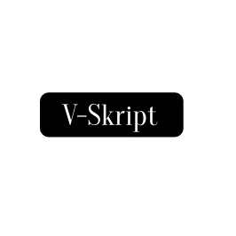

<!-- PROJECT LOGO -->
 

  

  <h3 align="center">vimscripts</h3>

  

  A lot of Vim scripts to introduce to you through the Vim basic scripting.
     
    <a href="https://github.com/github_username/repo_name">
     
     

<!-- TABLE OF CONTENTS -->

  
<h2 style="display: inline-block">Table of Contents</h2>

  <ol>
    <li>
      <a href="#about-the-project">About The Project</a>
      </li>
    <li>
      <a href="#getting-started">Getting Started</a>
      <ul>
        <li><a href="#prerequisites">Prerequisites</a></li>
        <li><a href="#installation">Installation</a></li>
      </ul>
    </li>
   <li><a href="#contributing">Contributing</a></li>
    <li><a href="#license">License</a></li>
   <li><a href="#acknowledgements">Acknowledgements</a></li>
  </ol>

## About The Project

[![Product Name Screen Shot][product-screenshot]](https://example.com)

These scripts represent the most fundamentals part of Vim scripting. You can find practical examples to develop your usability using Vim editor at the same time that learns code! Sometimes, in the initials stages when we are learning Vim, we find it difficult to grasp the concepts regardless of the time expending in through it.  Why? because Vim editor was created to be used just with keyboard inputs,  so if someone is accustomed to using another most modern editor, it will be more difficult.  In this project, I tried to create get fast compression about Vim and Vim scripting. 

<!-- GETTING STARTED -->
## Getting Started

### Prerequisites

To getting started, I recommend to you already have some pieces of knowledge about the basic Vim code editor, If not the case, you can get a quick introduction through the fundamentals here https://openvim.com/ or following the tutorial in the same Vim editor.

<!-- CONTRIBUTING -->
## Contributing

Contributions are what make the open source community such an amazing place to be learn, inspire, and create. Any contributions you make are **greatly appreciated**.

<!-- LICENSE -->
## License

Distributed under the MIT License. See `LICENSE` for more information.

<!-- ACKNOWLEDGEMENTS -->
## Acknowledgements

* 
* 
* 

